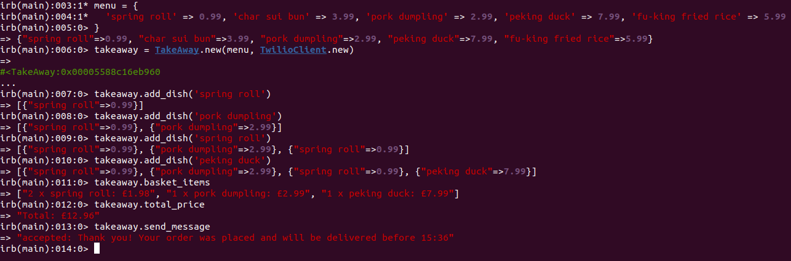

Takeaway Challenge
==================

This challenge is one of the weekend challenges set by Makers Academy, forked from [this](https://github.com/makersacademy/takeaway-challenge) repository.
```
                            _________
              r==           |       |
           _  //            |  M.A. |   ))))
          |_)//(''''':      |       |
            //  \_____:_____.-------D     )))))
           //   | ===  |   /        \
       .:'//.   \ \=|   \ /  .:'':./    )))))
      :' // ':   \ \ ''..'--:'-.. ':
      '. '' .'    \:.....:--'.-'' .'
       ':..:'                ':..:'

 ```

## Installation
 Make sure you have ruby 3.0.2 and bundler (2.2.26 is the version I used) installed on your system.

 Install gems:
 ```bash
 bundle install
 ```

## Text sender setup

To run this app you will first need to setup an account with [Twillio](www.twilio.com). After you have setup a number to text to and from you will need to put the following information into a `.env` file in the route of this project:

```
ACCOUNT_SID=account_sid
AUTH_TOKEN=auth_token
MESSAGING_SERVICE_SID=messaging_service_sid
RECEIVER_NUMBER=receiver_number
```

## Running app

### Building menu

The Takeaway class can take any hash menu you like in its first argument, as long as it follows the following format:

```ruby
{
  <description_string>: <price_float>
}
```

Here is a menu example:
```ruby
{
  'spring roll' => 0.99, 'char sui bun' => 3.99, 'pork dumpling' => 2.99, 'peking duck' => 7.99, 'fu-king fried rice' => 5.99
}
```

### Setting up app in irb

start irb with class files:
```bash
irb -r ./lib/takeaway -r ./lib/twilio_client
```

Load environment variables in irb:
```ruby
require 'dotenv'
Dotenv.load('.env')
```

### Using app



## My approach

### Binded formatting concerns with logic

The [review docs](docs/review.md) it suggests in the irb example for the main class (also dealing with the logic) return readable strings.
I originally confused this and the user stories to be informing me to print the strings to an output stream. I decided to unbind the output stream but still return readable strings as the formatting can be easily removed.

### User storys

I interpreted the user stories as the user being a user interface (or other interface) as part of a wider system.

```
As a customer
So that I can check if I want to order something
I would like to see a list of dishes with prices

As a customer
So that I can order the meal I want
I would like to be able to select some number of several available dishes

As a customer
So that I can verify that my order is correct
I would like to check that the total I have been given matches the sum of the various dishes in my order

As a customer
So that I am reassured that my order will be delivered on time
I would like to receive a text such as "Thank you! Your order was placed and will be delivered before 18:52" after I have ordered
```
